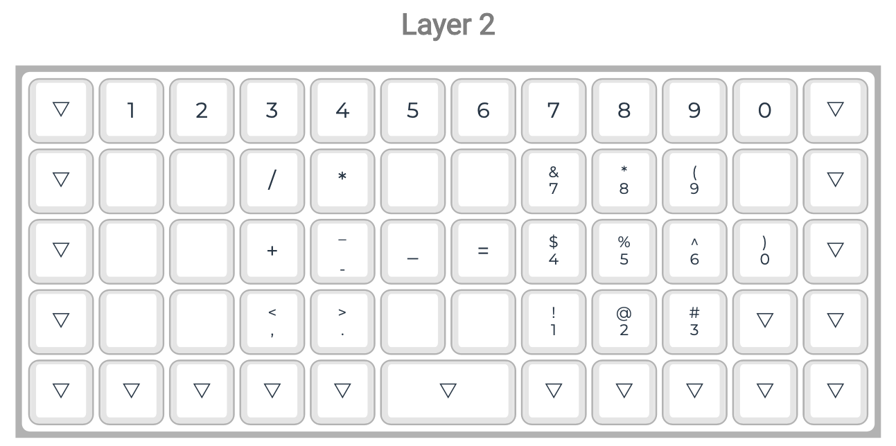
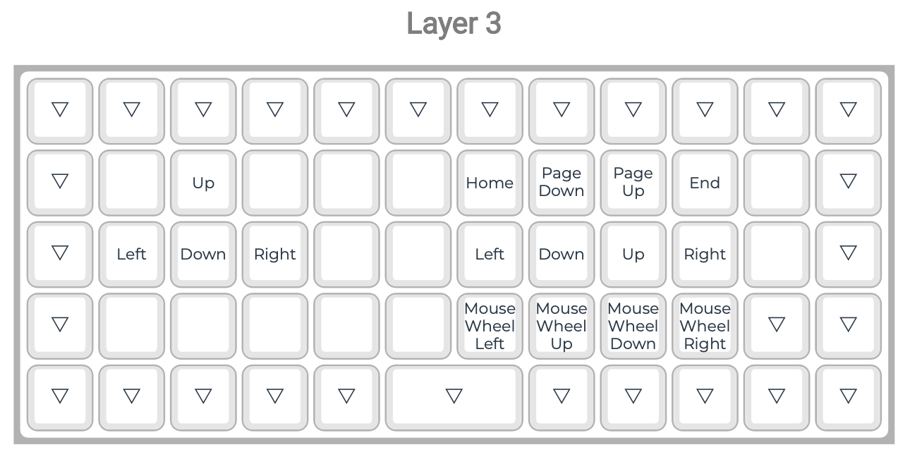
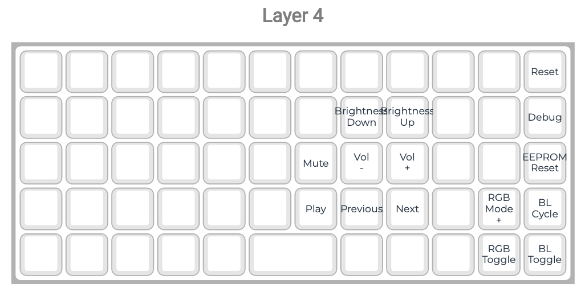

# Personal keyboard layout for Preonic rev3

## Keymap

### Base Layer

### Special Chars

### Numbers

### Movements

### Media

## Change Log

**v1.1**
Minor updates to special chars and numbers layers
- moved numpad one row down so that 456 are on homerow to mirror actual num block usage
- made "?' and "-" directly accessible in special char layer

**v1**
First working version
