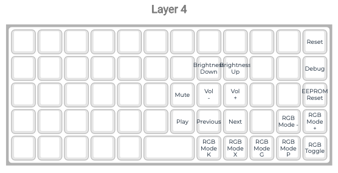

# Personal keyboard layout for Preonic rev3

## Keymap

### Base Layer

### Special Chars

### Numbers

### Movements

### Media

## Change Log

### v1.2 - Minor updates to RGB, numbers layer and special chars
- updated RGB keys on media layer
- created several "0" keys on number layer
- added "_" and "!" to special chars layer

### v1.1 - Minor updates to special chars and numbers layers
- moved numpad one row down so that 456 are on homerow to mirror actual num block usage
- made "?' and "-" directly accessible in special char layer

### v1
First working version
